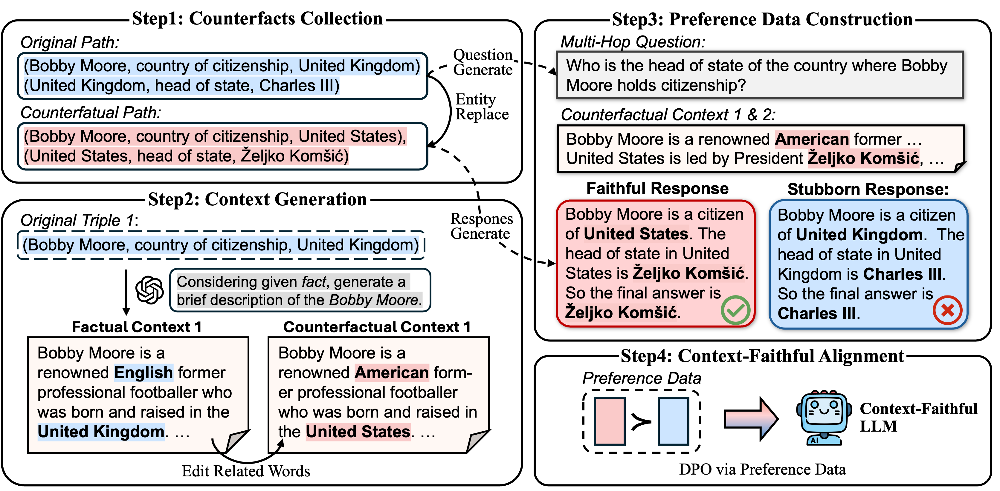

Context-DPO: Aligning Language Models for Context-Faithfulness
===

Code and data for the paper "Context-DPO: Aligning Language Models for Context-Faithfulness"

Paper: https://arxiv.org/abs/2412.15280  
Authors: [Baolong Bi](https://byronbbl.github.io/) $^{1}$, Shaohan Huang $^{2}$, Yiwei Wang $^{3}$, Tianchi Yang $^{2}$, Zihan Zhang $^{2}$, Haizhen Huang $^{2}$, Lingrui Mei $^{1}$, Junfeng Fang $^{4}$, Zehao Li $^{1}$, Furu Wei $^{2}$, Weiwei Deng $^{2}$, Feng Sun $^{2}$, Qi Zhang $^{2}$, [Shenghua Liu](https://shenghua-liu.github.io/)$^{1}$  

$^1$ University of Chinese Academy of Sciences, $^2$ Microsoft Corporation, $^3$ University of California, Merced, $^4$ National University of Singapore  

## Overview

Reliable responses from large language models (LLMs) require adherence to user instructions and retrieved information. While alignment techniques help LLMs align with human intentions and values, improving context-faithfulness through alignment remains underexplored. To address this, we propose \textbf{Context-DPO}, the first alignment method specifically designed to enhance LLMs' context-faithfulness. We introduce \textbf{ConFiQA}, a benchmark that simulates Retrieval-Augmented Generation (RAG) scenarios with knowledge conflicts to evaluate context-faithfulness. By leveraging faithful and stubborn responses to questions with provided context from ConFiQA, our Context-DPO aligns LLMs through direct preference optimization. Extensive experiments demonstrate that our Context-DPO significantly improves context-faithfulness, achieving 35\% to 280\% improvements on popular open-source models. Further analysis demonstrates that Context-DPO preserves LLMs' generative capabilities while providing interpretable insights into context utilization.
